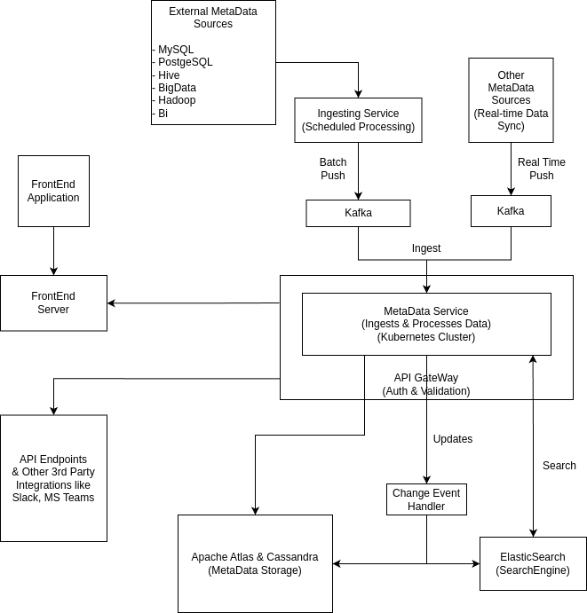

# Lily v2.0
> Diagrams at the Bottom

## Constraints and Assumptions

### Who is going to use Lily & How are they going to use it?
Assuming that Lily 2.0 platform is going to be used by End Users by FrontEnd GUIs & by API Endpoints(REST, GraphQL)

### How many users are there?
This question is the most important in terms of deciding the scale of system.
- If Lily is designed based on the assumption that the scale is very large then the design choices will have to slightly differ to that of desgin which is small in scale.
- While being prepared for the large scale is a good plan, I prefer starting small and delivering as soon as possible and iterating over the current design to optimize the current system and make it more scalable and fault tolerant.
- Cost is also a deciding factor while deciding the scale of the system. So, first we will start small and scale later while keeping the long term plan in mind.
- And Lily will be serving 1 million Users per month.

### How much data to ingest and in what form?
- Data to be ingested would be in different forms so it is difficult to assume the exact size of data to be ingested.
- Large amount of data to be handled by this platform, which mostly is columns in different tables and BI fields and other formsuch as databases, schemas, tables, and dashboards(90:10 split as given).

### How many requests per second do we expect (API Endpoints)?
- Assuming that the traffic is not evenly distributed, we can move ahead with the assumption of 40 Queries Per Second(QPS) on average.
- 40 QPS turns out to be 100 million requests per month.
- But we can expect Spikes upto 1000 QPS considering the amount of monthly users.

## Cloud Platorms
- Platform used for hosting will be:
    - **Amazon Web Service (AWS)**
    - **Google Cloud Platform (GCP)**
    - **Microsoft Azure**
- We will be using the **Kubernetes** Platform of each cloud provider which will help us desgin most parts uniformly and will prevent overhead of managing differences of each cloud infrastructure as and will also save us from vendor lock-in.
- Other things that would be needed to manage for different cloud platforms can be done using Terraform so that's it's easy to mange.
- We will be using the block storage & load balancers natively provided by each cloud plaform. That's something we will have to integrate with differences of each platform respectively.

## Architecture

### Kubernetes
- To manage Kubernetes environment particularly in multi-tenant scenarios **Loft Agent** is a good fit. It provides features for user management, resource quotas, self-service environments, and integration with CI/CD processes, making it easier for teams to work within shared Kubernetes clusters. 
- But the Github page of Loft has stars less than 1K, so it can be a very risky project to take on as it's not that popular.
- **Rancher** would be a better to adopt in out system for managing Kubernetes environments as along with multi-tenant scenarios it also allows us to manage multiple Kubernetes clusters across various environments with a focus on centralized management and comprehensive cluster administration. And the project is quite popular with 20+K stars on Github ensuring it's populairty.
- Although, **Rancher** does not specifically focus on managing multi-tenant environments within a single Kubernetes cluster unlike **loft** but loft being a less popular project possess a risk for future.
- **Argo Workplace** along with **ArgoCD** can be used for orchestration of complex workflows in our Kubernetes cluster along with having a CI/CD pipeline. **Helm Charts** can also be used for managing the service to be deployed on our Kubernetes cluster and optimizing them as Needed.

### MetaData StorageMySQL
- We will be using **Apache Atlas** with **Cassandra** for Processing and Storing Medtadata.
- Apache Atlas will handle the management, governing and processing of metadata, while Apache Cassandra serves as the storage layer for that metadata, ensuring it is available and scalable for various applications and services that need to access it.
- Apache Atlas will store the metadata as data in a graph database, which allows for complex relationships between data entities to be represented and queried efficiently. Apache Atlas can be easliy configured with HBase in an Hadoop environment.
- **Elasticsearch** will be used as a search engine that indexes data to provide fast and efficient search capabilities. In this system, it is used to index the metadata stored, allowing users to perform searches and retrieve information quickly.
- **Apache Zookeeper** will be used to provide essential services for coordination, configuration management, leader election, service discovery, synchronization, and fault tolerance, all of which are critical for the smooth operation of distributed systems.
- If we want to start the development radpidly and consider the different sources of ingestion we can use documnet based databases like MongoDB which would allow us to handle the diverse and evolving nature of the metadata and will be a a flexible, schema-agnostic or schema-flexible data model.

### Databases
- **Redis** being a key value database can be used by our microservices for in memory chaching.
- **PostgreSQL** can be used for storage by all our microservices, being a highly scalable relation database.

### Kafka
- To create an Event Driven Architecture, **Kafka** plays an important role. It allows for processing of data asynchonously and in automated manner which can help with the ingestion process and our systems will not be burdened at once.

### Authentication and Authorization
- Rather than reinventing the wheel and creating a system for email & password login we can leverage access management (IAM) system, such as **Apache Keycloak** or AWS Cognito to handle authentication and authorization.
- AWS Cognito isn't a good choice for multi-tenant setup. So, **Apache Keycloak** would be a better fit.

### Data Security & Compliance
- We will use **Apache Ranger** as it is a powerful tool for managing security in big data environments, providing centralized administration, fine-grained access control, and auditing capabilities.
- It is particularly useful to enforce data governance policies and ensure compliance with regulatory requirements. By integrating with various data services and identity management systems.

### Logging
- Since our microservices would be containerized and would be scaled up and down depending on demand, logging of our systems is a tricky problem.
- Traditional file logging won't work for a containerized environment, so we would have to use TCP Logging for our microservices.
- **FluentBit** will help us in logging and we can't send this logs directly to Elasticsearch or first to Kafka and then to Elasticsearch to not overload Elasticsearch instances during high traffic scenarios.

### Observability 
- For Observability of the entire platform we can use **Kibana** to monitor our systems from different data sources like logs of our microservices from **Elasticsearch** and system & other metrics from **Promethues**.
- We can also leverage the Grafana platform and extend on it using **Loki** for reading logs & **Grafana OnCall** for alerting and reporting incidents.
- **Kibana** can also used for getting valuable information from out logs stored in Elasticsearch. It helps with the debugging process as ingsights from logs can be extracted, saving a lot of time and effort of developers in debugging.

### Rate Limiting
- While desinging a microservice, Rate Limiting is an important point to consider. We can build the rate limiting feature in out microservice from ground up but this effort would be in vain if we don't have some custom usecases which **Kong** doesn't provide.
- **Kong** is a powerful and flexible API gateway that simplifies the management of APIs and microservices. Its features for security, load balancing, monitoring, and extensibility make it a popular choice. It enhance the performance and security of the applications.

### Other
- **Vault** can be integrated for securing credentials in code bases.

## Diagrams

### Simple Overview of the Ingestion System

### Platform Overview
- This is a multi-tenant Architecture.
- Load balancers, IAM & Bucket/Block Storage provided by each cloud provider would be used.
- Load Balancer
    - AWS = Application Load Balancer (ALB)
    - GCP = Cloud Armor + Load Balancer
    - Azure = Azure Load Balancer
- Bucket/Block Storage
    - AWS = Simple Storage Service (S3)
    - GCP = Google Cloud Storage (GCS)
    - Azure = Azure Blob Storage
 

